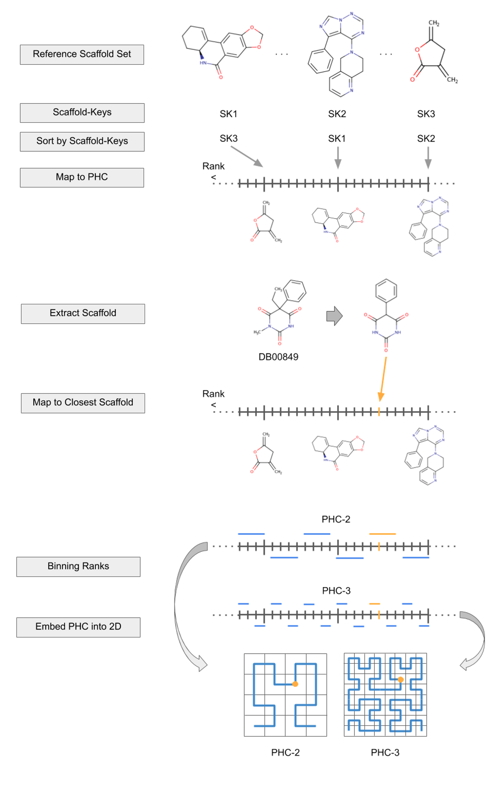

# This is the Source Code and Data Repository of the HCASE Method

**Reference**

[G. Zahoranszky-Kohalmi, K. K. Wan, A. G. Godfrey, Hilbert-Curve Assisted Structure Embedding Method, ChemRxiv, 28 February 2020, Version 1, DOI: 10.26434/chemrxiv.11911296.v1](https://chemrxiv.org/engage/chemrxiv/article-details/60c74874702a9bd9b418afaa)

# Process to Replicate the Analysis Enclosed in the HCASE Manuscript ######

## Prerequisites

* *Git*

* Git *Large File Support (LFS)*

`git lfs install --skip-smudge`

* *Conda* environment manager for Python

See: [https://conda.io/projects/conda/en/latest/user-guide/install/index.html](https://conda.io/projects/conda/en/latest/user-guide/install/index.html)

## Setting Up Repository

* Clone Repository

`git clone https://github.com/ncats/hcase`

* Pull Large Files

`cd hcase`

`git lfs pull` (this may take some time)

## Setting Up Conda Environment

`conda env create -f code/environment.yml`  (this step needs to be done only once, if you don't already have the *hcase* conda environment)

`conda activate hcase`  (this step is necessary everytime you want to run the HCASE method and/or the experiments)

## Execute All Experiments

`cd code/`

`bash reproduce_HCASE_experiments.sh`

## Alternatively, Executing Individual Steps

* Step 1: Create HCASE space using ChEMBL scaffolds

Run workflow in `HCASE_Embedding.ipynb` .

* Step 2: Embed approved drug molecules from DrugBank into HCASE ChEMBL Scaffold space, and visualize the kNNs (k=5) of select chemotypes. Additionally, this is compared to the position of the same select chemotypes and 25 randomly selected molecules. 

Run workflow in `HCASE_Experiments_KNN_in_HCASE_Space.ipynb` .

* Step 3: HCASE Embedding of Cherry-Picked Scaffolds and their 50+50 Immediate Neighbors Based on Scaffold-Key Ordering

Run workflow in `HCASE_Experiments_Cherry_Picked_Scaffolds.ipynb` .

* Step 4: Create the embedding of CANVASS molecules into HCASE ChEMBL space.

Run workflow in `HCASE_Experiments_CANVASS_into_HCASE_ChEMBL.ipynb` .

* Step 5: Create the embedding of approved drug and CANVASS molecules into HCASE NatProd space.

Run workflow in `HCASE_Experiments_Drugs_and_CANVASS_into_HCASE_NatProd.ipynb` .

* Step 6: Comparing HCASE ChEMBL and NatProd embeddings of approved drugs and CANVASS compounds

Run workflow in `HCASE_Experiments_Compare_HCASE_ChEMBL_NatProd_Embeddings.ipynb` .

* Step 7: Quantify overlap of approved drugs and CANVASS compounds embeddings in HCASE ChEMBL and NatProd spaces

Run workflow in `HCASE_Experiments_Quantify_Overlap.ipynb` .

* Step 8: Chebyshev Distance and Rank Distance Correlation.

Run workflow in `HCASE_Experiments_Chebyshev.ipynb` .

* Step 9: T-SNE Embedding of drugs and highlighting KNNs (k=5) of select molecules. Repeating the embedding and visualization on a reduced set (90%) of drugs.

Run workflow in `HCASE_Experiments_tSNE.ipynb` .

* Step 10: Creating an HCASE space using a reduced set (90%) of ChEMBL scaffolds, and the previously cherry-picked scaffolds. 

Run workflow `HCASE_Embedding_Reduced.ipynb` .

* Step 11: Creating the HCASE embedding of the cherry-picked scaffolds into the reduced HCASE ChEMBL space generated in the previous step.

Run workflow `HCASE_Experiments_Cherry_Picked_Scaffolds_in_Reduced_HCASE_Space.ipynb` .

* Step 12: Repeating Step 2, only the KNN analysis of approved drug molecules is performed in a reduced HCASE ChEMBL scaffold space (90% subset of original ChEMBL scaffold used to create the HCASE space). So-called Not-NN neighbor analysis is not repeated, only the KNNs of the randomly selected 5 drug molecules.

Run workflow `HCASE_Experiments_KNN_in_Reduced_HCASE_Space.ipynb` .

* Step 13: Perform embedding of cherry-picked scaffolds using the Altered t-SNE method into ChEMBL scaffold space. 

Run workflow `HCASE_Experiments_Altered_tSNE_CherryPicked_Scaffolds.ipynb` .

* Step 14: Repeating the previous step (Step 13) utilizing the union of the 90% subset of the reference scaffolds and the Cherry-Picked scaffolds.

Run workflow `HCASE_Experiments_Altered_tSNE_Reduced_HCASE_Space_CherryPicked_Scaffolds.ipynb` .

* Step 15: Embed approved drug molecules from DrugBank into Altered t-SNE ChEMBL Scaffold space, and visualize the kNNs (k=5) of select chemotypes. 

Run workflow `HCASE_Experiments_Altered_tSNE_KNN.ipynb` .

* Step 16: Repeating Step 15, i.e. performing the Altered t-SNE embedding of the same 5 randomly selected drug molecules and their KNNs with the difference that a 90% reduced Altered t-SNE scaffold space is used for the embedding.

Run workflow `HCASE_Experiments_Reduced_Altered_tSNE_KNN.ipynb` .

* Step 17: Aggregate embeddings.

Run workflow `HCASE_Experiments_Aggregate.ipynb` .

# License Related Section

This repository contains source code, Jupyter notebooks, data and results files which are organized into various subdirectories.

* Source code subdirectories:

`code/` and `aux_code`

* Data and results subdirectory:

`data/`

* Jupyter Notebooks:

 Jupyter Notebooks can be found in the `code/` and `data/execute_notebooks/` subdirectories (files of `.ipynb` extension).

* Workflows:

KNIME workflows can be found in `workflows/` subdirectory.

* Source Code License of HCASE Repository

The applicable license to source code can be found under filename: [code/LICENSE](code/LICENSE) and [aux_code/LICENSE](aux_code/LICENSE) (same license types, i.e. [https://opensource.org/licenses/MIT](MIT License)). This license is applicable to all files recursively in the source code subdirectories as defined above. The files [code/NOTES](code/NOTES) and [aux_code/NOTES](aux_code/NOTES) list source code modules that were utilized and their respective licenses. These modules have their own licenses which might be different from the Source Code License of this repository, and they need to be respected accordingly.

* Data License of HCASE Repository

The applicable license to data and results can be found under: [data/LICENSE](data/LICENSE) and [plots/LICENSE](plots/LICENSE) ([https://creativecommons.org/licenses/by/4.0/legalcode.txt](Creative Commons Attribution 4.0 International Public License	CC-BY 4.0 International)). This license is applicable to all files recursively in the data and results subdirectory as defined above. The files listed in [data/NOTES](data/NOTES) and [plots/NOTES](plots/NOTES) lists input files and resources utilized to perform the experiments and are considered as derivative work of those resources. These input files and resources have their own licenses which might be different from the Data License of this repository, and they need to be respected accordingly. In the same file we also list which results files can be considered as derivative works, and we also list the the respective ascendent data source(s).

* Jupyter Notebook License of HCASE Repository

Jupyter Notebboks are special in the sense that they are comprised of source code, but they can also contain embedded data and plot (graph) sections. This duality is resolved via dual-licensing as follows. The code sections of Jupter Notebooks fall under the same license as source codes, i.e. the MIT License [code/LICENSE](code/LICENSE)whereas data and plot sections embedded into the Jupyter Notebooks fall under the same license as data and result files, i.e. Creative Commons Attribution 4.0 International Public License	CC-BY 4.0 International License [data/LICENSE](data/LICENSE). Remarks enclosed in the [code/NOTES](code/NOTES) file are also valid for code section of the Jupyter Notebooks. Remarks enclosed in the [data/NOTES](data/NOTES) and [plots/NOTES](plots/NOTES) files are also valid for the embedded data and plots of the Jupyter Notebook files.

* Workflow License of HCASE Repository

KNIME workflows utilized in this study are contained in the `workflows/` directory, and are subject of the "KNIME License Terms and Conditions" see: `workflows/LICENSE`.

* Links to licenses

- MIT License: [https://opensource.org/licenses/MIT](https://opensource.org/licenses/MIT)

- Creative Commons Attribution-ShareAlike 3.0 Unported License: [https://creativecommons.org/licenses/by-sa/3.0/](https://creativecommons.org/licenses/by-sa/3.0/)

- Creative Commons Attribution 4.0 International Public License (CC-BY 4.0 International): [https://creativecommons.org/licenses/by/4.0/legalcode.txt](https://creativecommons.org/licenses/by/4.0/legalcode.txt)

- GPL-2 License: [https://www.gnu.org/licenses/old-licenses/gpl-2.0.en.html](https://www.gnu.org/licenses/old-licenses/gpl-2.0.en.html)

- GPL-3 License: [https://www.gnu.org/licenses/gpl-3.0.en.html](https://www.gnu.org/licenses/gpl-3.0.en.html)

- Apache License 2.0: [https://www.apache.org/licenses/LICENSE-2.0](https://www.apache.org/licenses/LICENSE-2.0)

- 3-Clause BSD license: [https://opensource.org/licenses/BSD-3-Clause](https://opensource.org/licenses/BSD-3-Clause), [https://github.com/scikit-learn/scikit-learn/blob/master/COPYING](https://github.com/scikit-learn/scikit-learn/blob/master/COPYING)

- KNIME: KNIME License Terms and Conditions [https://www.knime.com/downloads/full-license](https://www.knime.com/downloads/full-license)

# Remarks

Exporting Conda Environment for Reproduction

Critical packages and versions:

hilbertcurve: 1.0.3 
rdkit: 2018.09.1.0
networkx: 2.4

Exporting the environment:

`conda env export --from-history | grep -v "^prefix: " > code/environment.yml`

Manually modifying package versions of networkx and rdkit, and environment name:

name: hcase-env
  - rdkit==2018.09.1.0
  - networkx==2.4

# References

 
https://stackoverflow.com/questions/5226311/installing-specific-package-versions-with-pip?rq=1
 
https://stackoverflow.com/questions/38411942/anaconda-conda-install-a-specific-package-version
 
https://docs.conda.io/projects/conda/en/latest/user-guide/tasks/manage-environments.html
 
https://stackoverflow.com/questions/41274007/anaconda-export-environment-file
 
https://stackoverflow.com/questions/43222407/how-to-list-package-versions-available-with-conda
 
https://www.markdownguide.org/basic-syntax/
 
https://stackoverflow.com/questions/62852772/error-when-getting-git-lfs-files-object-does-not-exist-on-the-server-404-obj
